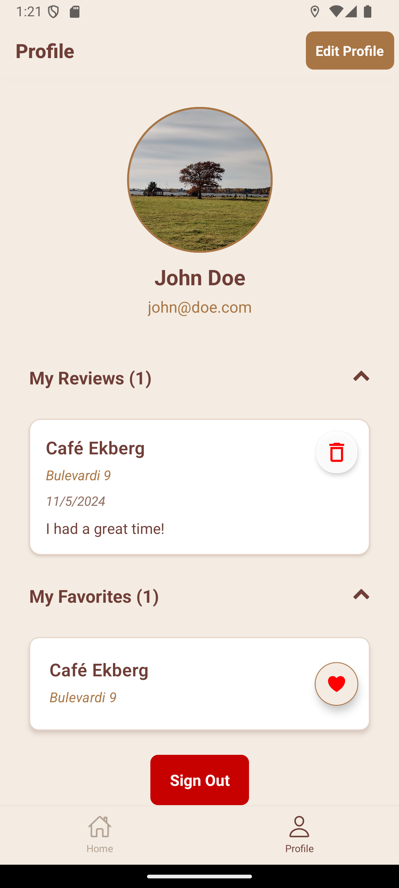
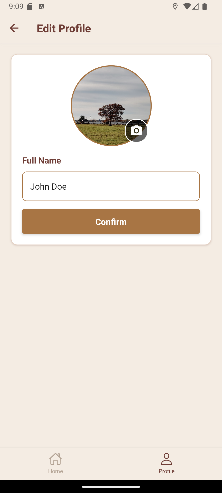

# CoffeeCompanion

CoffeeCompanion is your go-to mobile app for finding nearby coffee shops!

## Features

- **Nearby coffee shops on map**: Fetches coffee shops near your location from the Foursquare Places API, showing them on the map as points of interest.
- **Create an account**: Sign up for free to unlock the benefits of CoffeeCompanion.
- **Review your favorite coffee shops**: Share your thoughts and reviews of your favorite coffee shops for others to see and interact with.
- **Add coffee shops to favorites**: Save coffee shops to your personal favorites list for quick access.

## Table of Contents

- [Features](#features)
- [Installation](#installation)
- [Usage](#usage)
- [Screenshots](#screenshots)
- [Technologies Used](#technologies-used)

## Installation

### Steps

1. Clone the repository:
   ```bash
   git clone https://github.com/pr0fix/CoffeeCompanion
   ```
2. Navigate to the project directory:
   ```bash
   cd CoffeeCompanion
   ```
3. Install dependencies:
   ```bash
   npm install
   ```
4. Set up environment variables:
   Create a `.env` file in the root directory by following the `.env.template` which contains the following:
   ```
   FIREBASE_API_KEY=<your_firebase_api_key>
   FIREBASE_AUTH_DOMAIN=<your_firebase_auth_domain>
   FIREBASE_PROJECT_ID=<your_firebase_project_id>
   FIREBASE_STORAGE_BUCKET=<your_firebase_storage_bucket>
   FIREBASE_MESSAGING_SENDER_ID=<your_firebase_sender_id>
   FIREBASE_APP_ID=<your_firebase_app_id>
   FIREBASE_DB_URL=<your_firebase_realtime_db_url>
   FOURSQUARE_API_KEY=<your_foursquare_api_key>
   ```
5. Start the development server:
   ```bash
   npm start
   ```

### Important Notes

- If you are using a mobile device with Expo, make sure you are connected to the same network as your development device.
- If `npm start` doesn't work, try running:
  ```bash
  npm start --tunnel
  ```
- Currently the app is a frontend only implementation where it handles everything from fetching data and showing it by itself without a backend. Backend will be developed later on.

## Usage

Once the development server is running, you can scan the QR code displayed in the terminal or Expo Dev Tools to launch the app on your mobile device.

## Screenshots

#### Sign In, Sign Up & Form Validation
<kbd></kbd>
<kbd></kbd>
<kbd></kbd>

#### Home Screen, Bottomsheet & Review Form
<kbd></kbd>
<kbd></kbd>
<kbd></kbd>

#### Profile Page & Edit Profile Page
<kbd></kbd>
<kbd></kbd>

## Technologies Used

CoffeeCompanion is built using the following technologies:
- **Frontend**: React Native, Expo
- **Location & Mapping**: Expo Location, Foursquare Places API, React Native Maps
- **Authentication & Storage**: Firebase, Async Storage
- **Forms & Validation**: Formik, Yup
- **UI Components**: React Native Gesture Handler, React Native Bottom Sheet, React Native Vector Icons 


These technologies work together to create a seamless and efficient user experience in finding nearby coffee shops.
